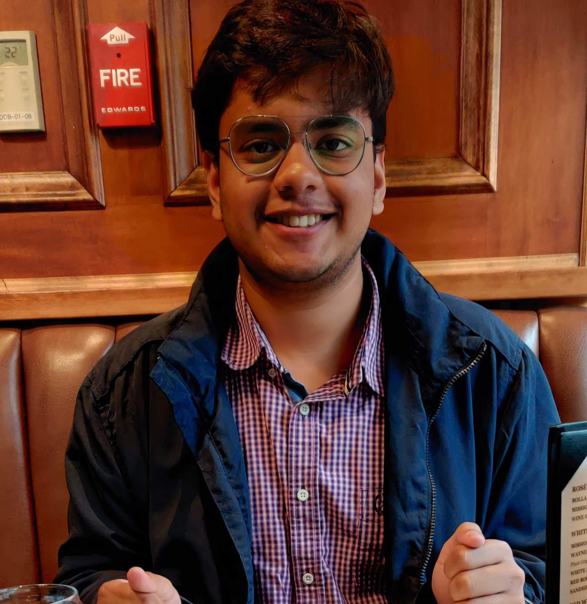

 
## Aabhaas Vaish
 
## About Me

Hey! I am Aabhaas Vaish. I am first year master's student at the University of Michigan, Ann Arbor majoring in Computer Vision. I am broadly interested in the applications of Deep Learning, specifically in Computer Vision, Natural Language Processing, and Reinforcement Learning.

As an undergraduate student at BITS Pilani, I got an amazing opportunity to work as a research intern with [Prof Bernhard Riecke](http://ispace.iat.sfu.ca/riecke/) at the [iSpace Lab](http://ispace.iat.sfu.ca/) at [Simon Fraser University](http://www.sfu.ca/), through the [MITACS Globalink Research Internship](https://www.mitacs.ca/en/programs/globalink/globalink-research-internship) program. I got the opportunity to work on emotional state recognition in EEG signals using different deep neural networks such as LSTM Networks, hybrid CNN-RNN Networks, and Deep Belief Networks.

After my sophomore year, I was fortunate enough to get a chance to intern at the [Indian Institute of Remote Sensing](https://www.iirs.gov.in/), a research centre of [Indian Space Research Organization (ISRO)](https://www.isro.gov.in/) where I worked on tracking and detecting vehicles in video feeds using computer vision methods such as RCNN, YOLO, and SSD.

While my primary research interests are in deep learning, I also enjoy learning about the advances made in Distributed Computing and IoT, which led to this paper on the [Industrial Applications of Edge and Fog Computing!](https://arxiv.org/abs/1912.00595)

---
Feel free to say hello on email: aabhaas9 [at] gmail [dot] com

Here is my profile on [Google Scholar!](https://scholar.google.com/citations?user=RZFBI7sAAAAJ&hl=en)

Let's connect on [LinkedIn](https://www.linkedin.com/in/aabhaas-vaish/)

Find me on [GitHub!](https://github.com/aabhaas-vaish/)

---
